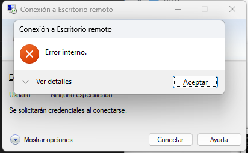

# Guia Practica 2

1. Usaremos una imagen de Windows Server 2019 Standard y otra de Windows 10, que seran, "StefanScherer/windows_2019" y "gusztavvargadr/windows-10" respectivamente.
2. Añadiremos un Vagrantfile al directorio, en el que configuraremos la maquina virtual.
3. En el Vagrantfile escribiremos lo siguiente:
    - Cambiaremos el nombre de las maquinas virtuales a server1 y server2 para ello pondremos el comando `vb.name = "server1"` dentro del comando `config.vm.provider "VirtualBox" do |vb|`
    - Para asignarle memoria RAM tendremos que poner dentro del comando `config.vm.provider "VirtualBox" do |vb|` lo siguiente: `vb.memory = 4096` para el Windows Server y `vb.memory = 2048` para el Windows 10 donde el número son los MB que queremos asignarle.
    - Para cambiar el número de cores virtuales pondremos dentro de `config.vm.provider "VirtualBox" do |vb|` el comando `vb.cpus = 4` para el Windows Server y `vb.cpus = 2` para el Windows 10, el número es el número de CPUs. 
    - Para poner un adaptador a una red privada pondremos el comando: `config.vm.network "private_network", ip: ""` y le pondremos una IP valida como por ejemplo 172.16.5.10 a el Windows Server y 172.16.5.20 para el Windows 10, con este podremos interconectar las maquinas entre si.
    - Para podernos conectar con escritorio remoto desde el anfitrion tendremos que habilitar conexiones RDP desde el anfitrion para ello pondremos los siguientes comandos:
     -  `config.vm.network "forwarded_port", guest: 22, host: 2200`
     -  `config.vm.network "forwarded_port", guest: 22, host: 8080`
    Ahora tendremos un puerto del anfitrión conectado con cada maquina virtual.
4. Para acceder a una de las maquinas desde el escritorio remoto tendremos que poner una dirección IP valiada y el puerto al que esta asignada la maquina, por ejemplo: 127.0.0.1:2200 para conectarse a la maquina server1
5. El escritorio remoto no funcionaba 
   