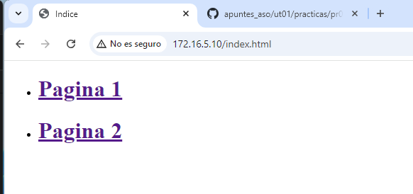
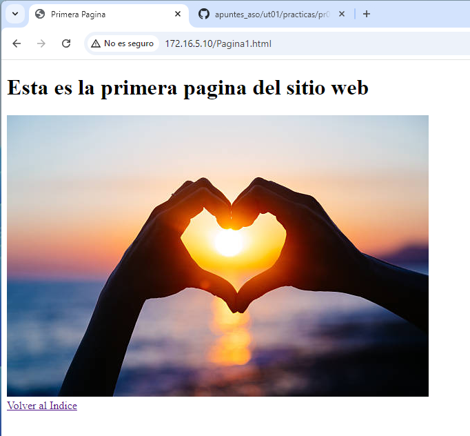
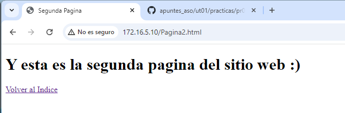

# Guia Practica 3

1. Usaremos una imagen de Ubuntu Server 20.04, en mi caso, la siguiente: "gusztavvargadr/ubuntu-server-2004-lts"
2. Ejecutaremos el comando "vagrant init gusztavvargadr/ubuntu-server-2004-lts" y se nos añadira un Vagrantfile al directorio, que contiene la configuración de la maquina virtual
3. Usaremos el comando "vagrant up" para iniciar la maquina
4. Ahora, iremos al Vagrantfile y escribiremos lo siguiente:
    - Para cambiar el nombre de la maquina virtual a Web Server pondremos el comando vb.name = "ubuntu server" dentro del comando config.vm.provider "VirtualBox" do |vb|
    - Para asignarle memoria RAM tendremos que poner dentro del comando config.vm.provider "VirtualBox" do |vb| lo siguiente vb.memory = 3072 donde el número son los MB que queremos asignarle
    - Para cambiar el número de cores virtuales pondremos dentro de config.vm.provider "VirtualBox" do |vb| el comando vb.cpus = 2 
    - Para cambiar el nombre del equipo (hostname) pondremos lo siguiente; config.vm.hostname = "web-dbc"
    - Para poner un adaptador a una red privada pondremos el comando: config.vm.network "private_network", ip: "" y le pondremos una IP valida como por ejemplo 172.16.5.10
    - Para poner un adaptador a una red publica pondremos el comando: config.vm.network "public_network", ip: "" y le pondremos una IP valida como por ejemplo 10.99.25.100
5. Para instalar un servidor apache escribiremos en la terminal el comando sudo apt install apache2
    - Para crear una pagina html en la maquina virtual tendremos que compartir una carpeta en la que crearemos el html para ello usaremos el comando config.vm.synced_folder "/data" en el Vagrantfile
    - Para sincronizar una carpeta de la maquina con un directorio usaremos este comando: config.vm.synced_folder "./html", "/var/www/html"
    - Tras crear la pagina web, escribiremos en un buscador, por ejemplo Chrome la IP privada de la maquina, ya que esta conecta la maquina con el equipo.

 
 
