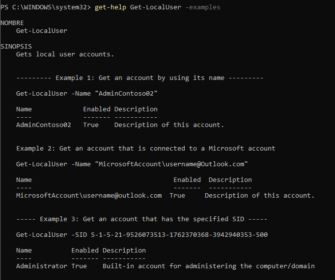
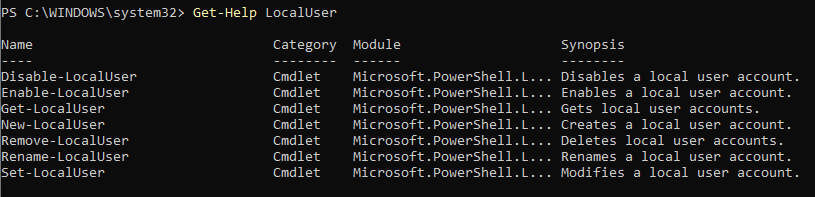
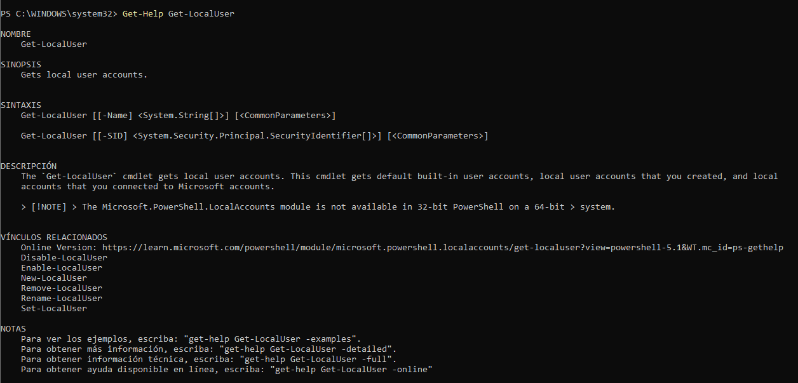
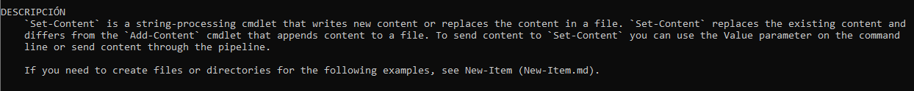
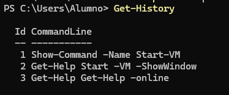
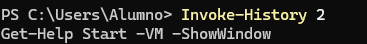
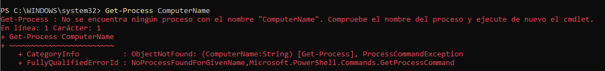
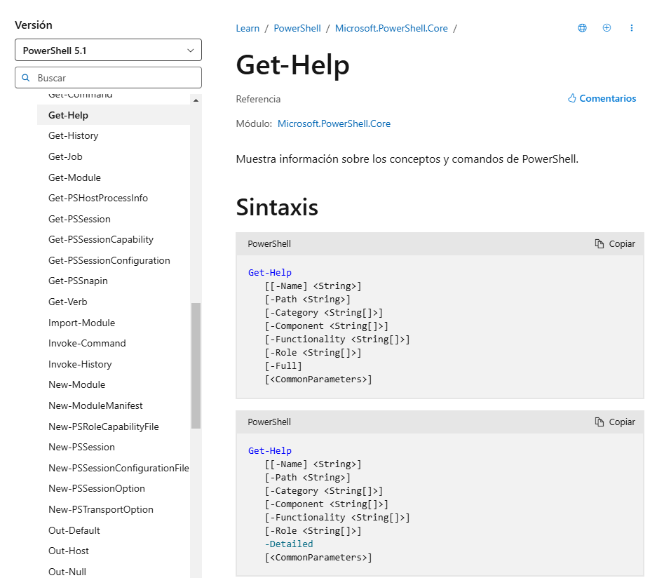
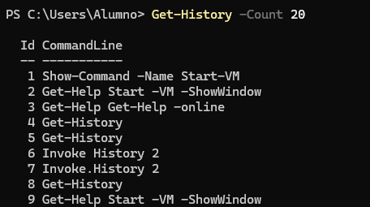

# Guía Practica 1
- Ejemplos de utilización del comando `Get-LocalUser`:

- Comandos relacionados con la gestión de usuarios locales (`LocalUser`):

- Mostrar la ayuda del comando `Get-LocalUser`: 

- El comando `Set-Content` sirve para añadir contenido a un fichero o cambiar el contenido según lo que se indique en el comando:

- Para ver un comando usado anteriormente, existen varias formas, una es usar la flecha de direccion del teclado hacia arriba, otra, con el comando `Get-History` que muestra un listado con todos los comandos que has usado en la sesión y el orden en el que los has utilizado, otra forma es con el comando `Invoke-History 2` donde el número es el orden en el que sale en el comando `Get-History` y devolvera el comando que se le indica:

- El comando `Get-Process` no tiene ningún párametro llamado `ComputerName`: 

- Para mostrar la ayuda del comando `Start-VM` en una ventana emergente usaremos el comando `Show-Command -Name Start-VM`.
- Para que nos mueste la ayuda del comando `Get-Help` en el navegador usaremos `Get-Help Get-Help -Online`, se nos abrira una pestaña en el navegador donde nos mostrara la ayuda de `Get-Help`:

- Podemos volver a usar `Get-History` para ver las ultimas 20 entradas del historial, solo que ahora le añadiremos `-Count 20`:

- Para eliminar las entradas 10, 12 y 14 del historial usaremos el comando `Remove-History` que sirve para eliminar el historial, acompañado de un `-Id` más el número del comando que queremos eliminar, por ejemplo, `Remove-History -Id 10`.
